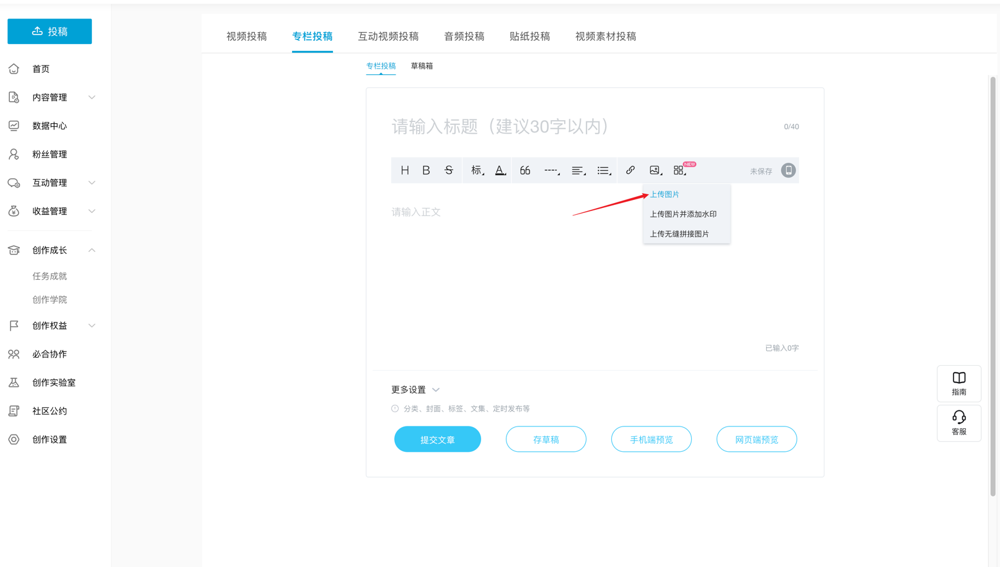
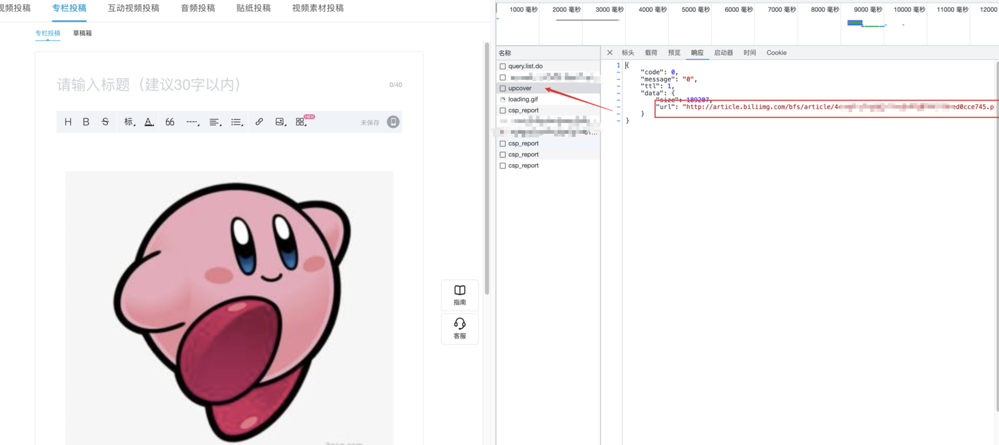
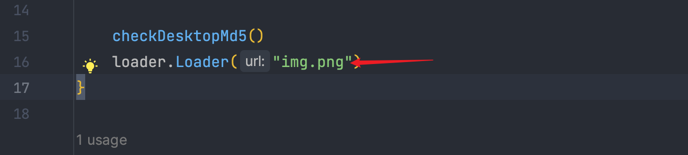
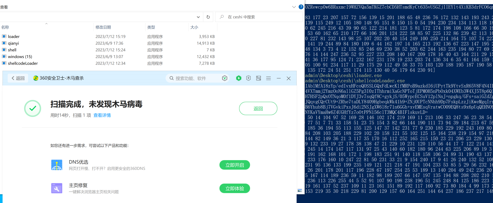
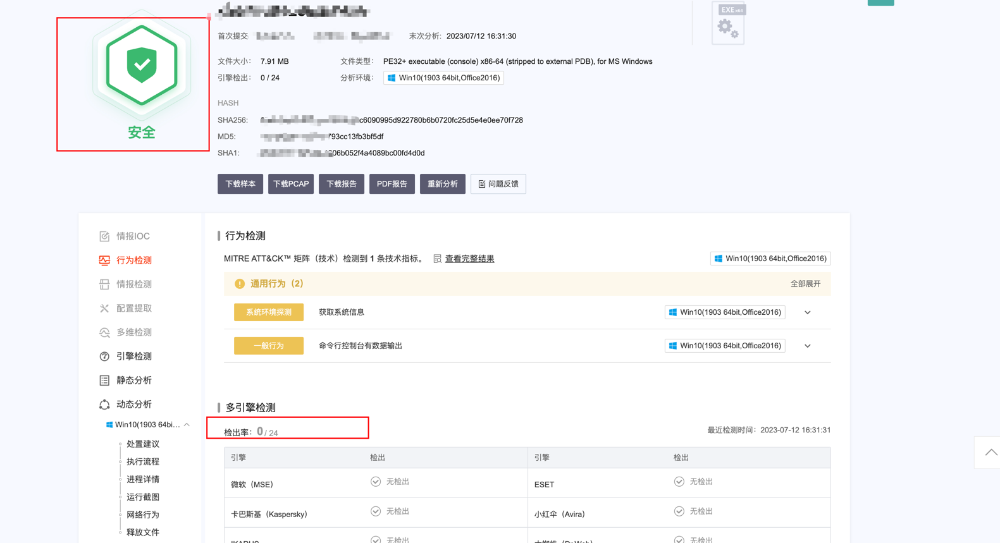
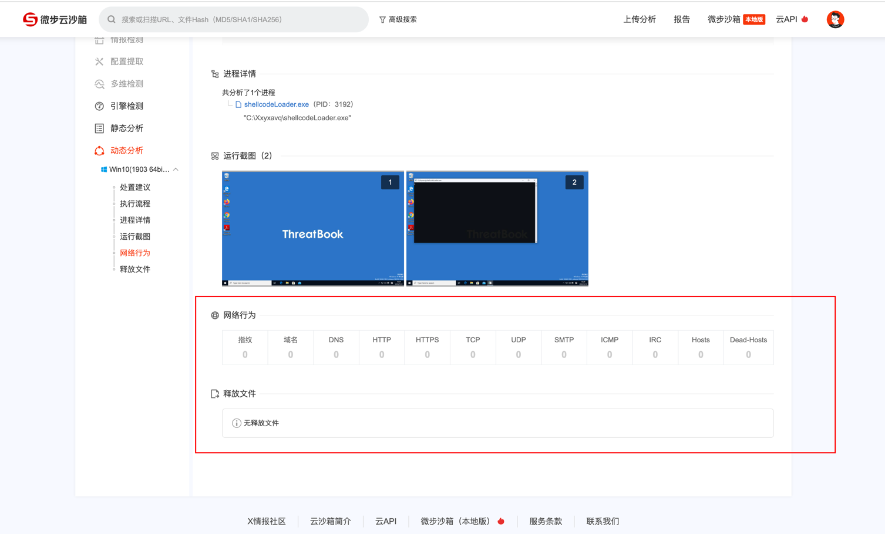

# bimg-shellcode-loader
bimg-shellcode-loader是一个使用bilibili图片隐写功能加载shellcode的工具。 当然你可以使用任何地方的图片。 

在调研C2通讯方式时，发现有一个有师傅使用了bilbili图片隐写功能加载shellcode，觉得这个方法很有意思，就自己写了一个工具。添加了反沙箱功能。  
如果这个项目对你有帮助，欢迎star。

### 使用步骤
##### 1. 生成包含隐写信息的图片  
使用generate.go生成包含shellcode的图片，生成的图片为out_file.png。
在generate.go同级目录下存放shellcode文件，shellcode文件名为shellcode.bin。
图片为img.png, 随后用运行generate.go生成out_file.png。
```shell
go run generate.go
```

##### 2. 上传图片到bilibili  
   登陆访问创作中心 https://member.bilibili.com/platform/upload/text/edit 点击上传图片，把生成的图片上传上去。
   

通过浏览器开发者工具，查看上传图片的请求，找到图片的返回地址，复制下来。



把图片地址填入到shellcodeLoader.go中的`imgUrl`变量中。


##### 3. 编译加载器
```go
CGO_ENABLED=0 GOOS=windows GOARCH=amd64 GOPRIVATE=* GOGARBLE=* garble -tiny -literals -seed=random build -ldflags  "-w -s -buildid= -H=windowsgui" -buildmode="pie"
```

### 免杀
只测试了360和微步


微步反沙箱，判断当前系统壁纸，如果是沙箱内的壁纸就退出。大家有遇到的沙箱或者分析机，提取壁纸的md5放入列表中。
```go
md5List := []string{"fbfeb6772173fef2213992db05377231", "49150f7bfd879fe03a2f7d148a2514de", "fc322167eb838d9cd4ed6e8939e78d89", "178aefd8bbb4dd3ed377e790bc92a4eb", "0f8f1032e4afe1105a2e5184c61a3ce4", "da288dceaafd7c97f1b09c594eac7868"}
```
微步沙箱检测通过0/24，并且没有检测到网络通信。




## Stargazers over time

[](https://starchart.cc/intbjw/bimg-shellcode-loader)

#### Visitors (Since 2023/08/01)
<div>

</div>
